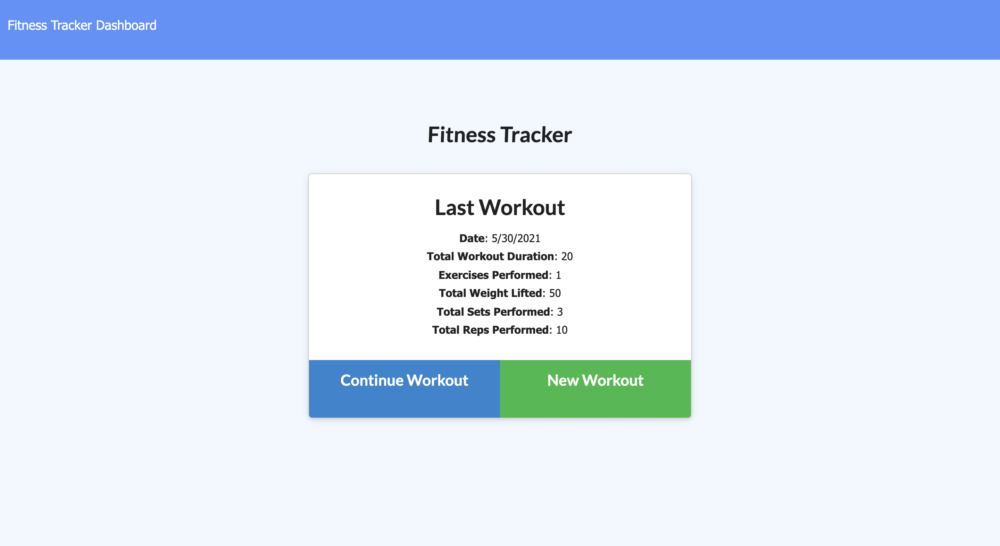

# fitness-tracker

## Overview

The purpose of this application is to create, update, and get new workouts and exercises to track your fitness. You can also view your progress and workout history through a dashboard. Built using starter code, a mongo database, mongodb docs, and heroku, this app also allows you to split your workouts by resistance or cardio. 
 
 
 
## Usage
Available to everyone
## Installation
Download repo, and in a command line, run npm seed, followed by npm start. 
## Deployed Site
[Click here](https://boiling-wildwood-52835.herokuapp.com/?id=60b34898059e530015f79c73) to access the deployed site. 
## License
The MIT License (MIT)

Copyright (c) Kelsey Benedict

Permission is hereby granted, free of charge, to any person obtaining a copy of this software and associated documentation files (the "Software"), to deal in the Software without restriction, including without limitation the rights to use, copy, modify, merge, publish, distribute, sublicense, and/or sell copies of the Software, and to permit persons to whom the Software is furnished to do so, subject to the following conditions:

The above copyright notice and this permission notice shall be included in all copies or substantial portions of the Software.

THE SOFTWARE IS PROVIDED "AS IS", WITHOUT WARRANTY OF ANY KIND, EXPRESS OR IMPLIED, INCLUDING BUT NOT LIMITED TO THE WARRANTIES OF MERCHANTABILITY, FITNESS FOR A PARTICULAR PURPOSE AND NONINFRINGEMENT. IN NO EVENT SHALL THE AUTHORS OR COPYRIGHT HOLDERS BE LIABLE FOR ANY CLAIM, DAMAGES OR OTHER LIABILITY, WHETHER IN AN ACTION OF CONTRACT, TORT OR OTHERWISE, ARISING FROM, OUT OF OR IN CONNECTION WITH THE SOFTWARE OR THE USE OR OTHER DEALINGS IN THE SOFTWARE.